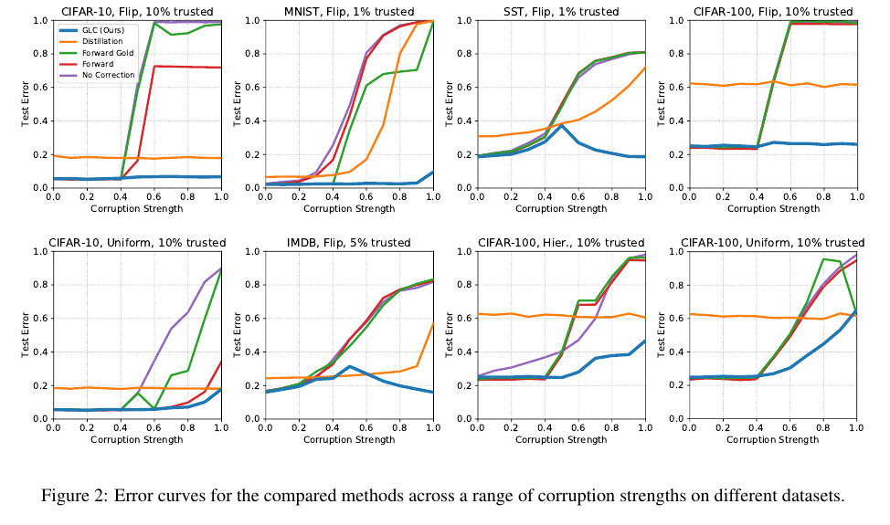
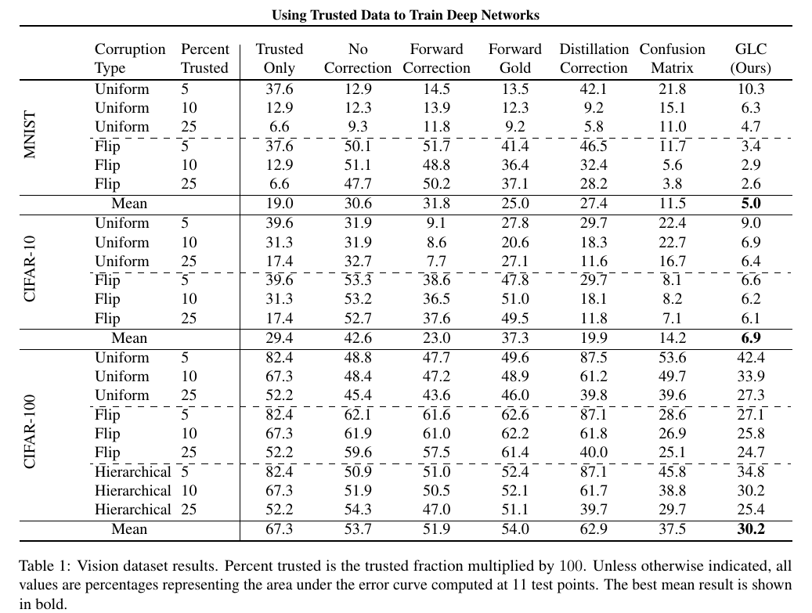

# Gold Loss Correction

This repository contains the code for the paper

[Using Trusted Data to Train Deep Networks on Labels Corrupted by Severe Noise (NeurIPS 2018)](http://arxiv.org/abs/1802.05300).

The code requires Python 3+, PyTorch [0.3, 0.4), and TensorFlow (for loading MNIST).

## Overview

The Gold Loss Correction (GLC) is a semi-verified method for label noise robustness in deep learning classifiers. Using a small set of data with trusted labels, we estimate parameters of the label noise, which we then use to train a corrected classifier on the noisy labels. We observe large gains in performance over prior work, with a subset of results shown below. Please consult the paper for the full results and method descriptions.
 

## Replication

To obtain accuracies, run the following scripts.

Non-CIFAR:
`python <dataset>_experiments_pytorch.py --method $1 --corruption_type $2`

CIFAR:
`python train_<method>.py --gold_fraction $1 --corruption_prob $2 --corruption_type $3`

Change 'dataset', 'method', and the command line arguments to specify the experiment to be run. The non-CIFAR scripts return percent accuracies for all gold fractions and corruption probabilities, while the CIFAR scripts only give one accuracy value at a time. Area under the error curve can be obtained by running numpy.trapz on the list of percent errors for corruption probabilities from 0.1 to 1.0 inclusive.

## Citation

If you find this useful in your research, please consider citing:

    @article{hendrycks2018glc,
      title={Using Trusted Data to Train Deep Networks on Labels Corrupted by Severe Noise},
      author={Hendrycks, Dan and Mazeika, Mantas and Wilson, Duncan and Gimpel, Kevin},
      journal={Advances in Neural Information Processing Systems},
      year={2018}
    }
